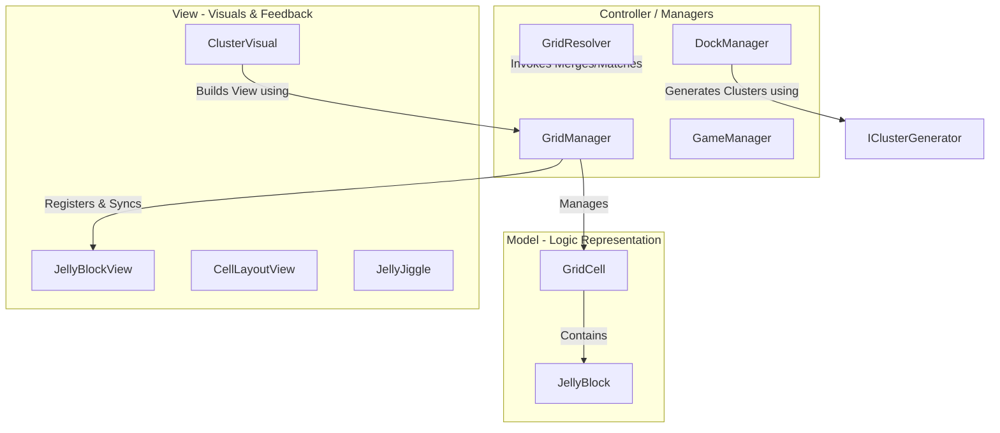

# 🎮 JELLY FIELD - PROJECT OVERVIEW

🌐 **Language:** [English](README.md) | [Tiếng Việt](README_VI.md)

---

Welcome to the development and architecture documentation for the **JellyField** project. This repository contains the source code for a premium 3D grid-based puzzle game focusing on jelly blocks shifting, matching, and physical feedback cascade mechanics.

---

## 📝 Project Description (What it does)
* **Project Type:** A 3D Jelly puzzle game running on a grid system (with embedded sub-slot matrix coordinates).
* **Core Mechanics:** The player drags and places jelly clusters from the Dock onto the grid board. The system automatically triggers the following cascade:
  1. Performs color matching analysis across major cell boundaries.
  2. Shifts blocks downwards to fill empty slots under gravity.
  3. Executes continuous combo resolution loops until determining the Win state (cleared all level goals) or Lose state (grid full).

---

## 🛠️ Technologies & Tools
* **Engine:** Unity.
* **Graphics & Visuals:**
  * **Universal Render Pipeline (URP):** Render pipeline optimized for high performance on mobile devices.
  * **Vertex Shader Graph:** Handles vertex deformation effects, creating the elastic jelly-wobble motion directly on the GPU using a `_BendOffset` parameter, which avoids CPU bottlenecks.
  * **DOTween:** Leveraged as a mathematical driver to smoothly interpolate Vector3 values passed into the Shader Graph properties.
* **Input System:** **New Input System** (abstracted through `Pointer.current`) to support seamless interactions on mouse click (PC / Editor) and multitouch (Android APK).

---

## 🏛️ Architecture & Design Patterns

The codebase is built on top of robust software engineering patterns to ensure high performance, decoupling, and platform versatility.



### 1. Model-View-Controller (MVC) Separation
- **Model (Pure Logic):** `JellyBlock` and `GridCell` are lightweight, pure C# classes devoid of MonoBehaviour references. They record logical states (Unique IDs, `BlockColor` enums, and local coordinates).
- **View (Visuals):** `JellyBlockView`, `CellLayoutView`, and `ClusterVisual` manage 3D meshes, sizing multipliers, and coordinate GPU-driven Vertex Shader deformations (smoothly interpolating the custom `_BendOffset` graph property via DOTween) for fluid elastic wobbles.
- **Controller (Coordination):** `GridManager` maps visual GameObjects to logic models via a decoupled registration system (`RegisterVisuals`, `GetVisuals`). This prevents the logical state from becoming coupled to the rendering thread.

### 2. SOLID Principles
- **SRP (Single Responsibility):** Clean separation of concerns. `GridManager` is solely responsible for grid cell registration. The physics layout scaling is moved to `CellLayoutView`, while cascade checks and explosions are handled by `GridResolver`.
- **OCP (Open-Closed):** The Dock slot generator handles spawning through the `IClusterGenerator` interface. Switching from fixed preset levels to infinite procedurally-generated queues is done by writing new implementations of `IClusterGenerator` without modifying `DockManager`.
- **DIP (Dependency Inversion):** Reduced coupling between systems. High-level orchestrators call abstract registries and interfaces, rather than hardcoding concrete instances.

### 3. Level Configuration Management
- Leverages Unity's **ScriptableObject** (`LevelData`) to define and store grid shapes, targets, pre-placed blocks, and predefined cluster lists.

---

## 📂 Project Directory Structure

```bash
Assets/_Game/Scripts/
├── Core/          # Model classes, tags, and central controllers (GridManager, GridResolver, DraggableGroup)
├── Logic/         # Stateless static engines for matches and merges (MatchResolver, MergeResolver)
├── Managers/      # Game loop, audio channels, and cluster generators (GameManager, DockManager)
├── Level/         # ScriptableObject level definitions (LevelData) and editor backend layouts
├── View/          # Visual presentation layer, meshes, DOTween, and juice FX (CellLayoutView, JellyJiggle)
├── UI/            # Canvas UI views, HUD panels, and overlay states (GameUIManager, GoalItemUI)
└── Editor/        # Custom Unity Inspector GUI interfaces for design workflows
```

---

## ⚡ Core Algorithms

### A. Inter-Cell Boundary Matching (`MatchResolver` / BFS Search)
Matches are computed across cell boundaries using a breadth-first search (BFS) flood-fill.
```csharp
// Checks if two blocks in neighboring cells are in physical contact at the boundary
private static bool CheckBorderContact(Vector2Int coordA, JellyBlock blockA, Vector2Int coordB, JellyBlock blockB)
```
If a contiguous cluster of matching color is formed, the match is validated, prompting the cascade and clearing mechanics.

### B. Resolution Cascade (`GridResolver`)
The cascade runs via a sequential Coroutine to maintain exact animation timing:
1. **Inter-Cell Match:** Detect clusters, detach visuals for explosion, and play particle/bounce FX.
2. **Gravity/Shift:** Reposition remaining blocks and update internal data registers -> play spring landing effects on the Shader.
3. **End Game Check:** Verify if all level goals are cleared (Win) or if the grid is locked with no empty slots (Lose).

---

## 💡 Scalability Recommendations (Future Upgrades)

1. **Object Pooling:** Implement a pool of block views instead of using `Instantiate`/`Destroy` calls to prevent memory fragmentation and Garbage Collection spikes on lower-end mobile devices.
2. **State Machine:** Refactor game state management into a formal State Machine class architecture to clean up state checking in `GameManager` and simplify adding features like Pausing or Tutorials.
3. **Dependency Injection:** Integrate **Zenject** or **VContainer** to handle references when the project scales, reducing coupling caused by singletons (`Instance`).
