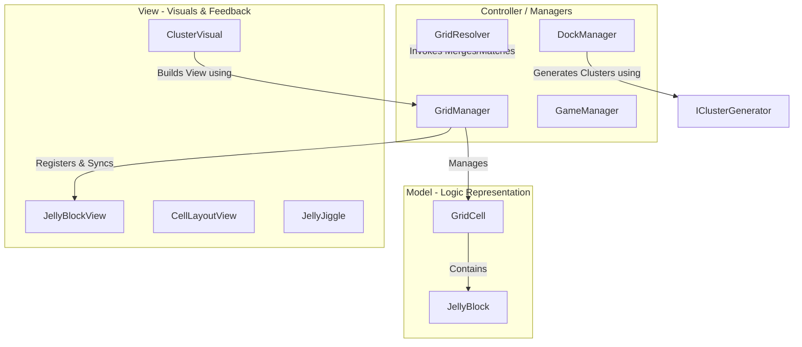

# JellyField

A premium 3D grid-based puzzle game built in Unity, focusing on jelly blocks merging, shifting, and matching mechanics.

---

## 🚀 Architecture & Design Patterns

The codebase is built on top of robust software engineering patterns to ensure high performance, decoupling, and platform versatility.



### 1. Model-View-Controller (MVC) Separation
- **Model (Pure Logic)**: `JellyBlock` and `GridCell` are lightweight C# classes devoid of Monobehaviour references. They record purely logic values (Unique IDs, `BlockColor` enums, and local coordinates).
- **View (Visuals)**: `JellyBlockView`, `CellLayoutView`, and `ClusterVisual` manage 3D meshes, sizing multipliers, GPU-driven Vertex Shader deformations (smoothly interpolating the custom _BendOffset graph property via DOTween), and elastic fluid jiggles.
- **Controller (Coordination)**: `GridManager` maps visual GameObjects to logic models via a decoupled registration system (`RegisterVisuals`, `GetVisuals`). This prevents the logical state from becoming coupled to the rendering thread.

### 2. SOLID Principles
- **Single Responsibility (SRP)**: Clean separation of concerns. `GridManager` is solely responsible for grid cell registration. The physics layout scaling is moved to `CellLayoutView`, while cascade checks and explosions are handled by `GridResolver`.
- **Open-Closed (OCP)**: The Dock slot generator handles spawning through the `IClusterGenerator` interface. Switching from fixed preset levels to infinite procedurally-generated queues is done by writing new implementations of `IClusterGenerator` without modifying `DockManager`.
- **Dependency Inversion (DIP)**: Reduced coupling between systems. High-level orchestrators call abstract registries and interfaces, rather than hardcoding concrete instances.

### 3. Modern Input System
Integrated Unity's **New Input System** using `UnityEngine.InputSystem.Pointer`. Interaction coordinates and click/press vectors are dynamically parsed from the active system pointer (mouse or primary touch contact).
- Full compatibility with Windows standalone build (mouse click).
- Native out-of-the-box multitouch support for Android APK platform.

### 4. GPU-Accelerated Vertex Shaders
To achieve the "juicy jelly" organic wobble without stressing the CPU transform matrix loop, the project utilizes a custom Universal Render Pipeline (URP) Shader Graph (`JellyShaderGraph`). 
- Drag, drop, and merge impacts alter vertex displacement coordinates directly on the GPU using a `_BendOffset` parameter.
- DOTween is strictly leveraged as a mathematical driver to interpolate Vector3 values, avoiding physics transform scale bottlenecks.

---

## 📂 Project Directory Structure

```bash
Assets/_Game/Scripts/
├── Core/          # Model classes, tags, and central controllers (GridManager, GridResolver, DraggableGroup)
├── Logic/         # Stateless static engines for matches and merges (MatchResolver, MergeResolver)
├── Managers/      # Game loop, audio channels, and cluster generators (GameManager, DockManager)
├── Level/         # ScriptableObject level definitions (LevelData) and editor backend layouts
├── View/          # Visual presentation layer, meshes, DOTween, and juice FX (CellLayoutView, JellyJiggle)
├── UI/            # Canvas UI views, HUD panels, and overlay states (GameUIManager, GoalItemUI)
└── Editor/        # Custom Unity Inspector GUI interfaces for design workflows
```

---

## ⚡ Game Logic & Core Algorithms

### A. Intra-Cell Merging (`MergeResolver`)
When blocks are placed in a grid cell, blocks of identical color within that cell are consolidated. 
The algorithm merges local coordinates and scales the corresponding 3D block views to represent the combined mass, ensuring that no space inside the cell is wasted.

### B. Inter-Cell Boundary Matching (`MatchResolver`)
Matches are computed across cell boundaries using a breadth-first search (BFS) flood-fill.
```csharp
// Checks if two blocks in neighboring cells are in physical contact at the boundary
private static bool CheckBorderContact(Vector2Int coordA, JellyBlock blockA, Vector2Int coordB, JellyBlock blockB)
```
If a contiguous cluster of matching color is formed, the match is validated, prompting the cascade and clearing mechanics.

### C. Resolution Cascade (`GridResolver`)
The cascade runs via a sequential Coroutine:
1. **Intra-Cell Merge:** Collapse and update visual sizes.
2. **Inter-Cell Match:** Detect clusters, detach visuals for explosion, and play particle/bounce FX.
3. **Gravity/Shift:** Reposition remaining blocks and update internal data registers.
4. **End Game Check:** Verify if all level goals are cleared (Win) or if the grid is locked with no empty slots (Lose).

---

## 🛠️ Installation & Setup

1. Clone this repository to your local drive.
2. Open the project in Unity Editor (recommended version: **Unity 6000.5.0f1** or newer).
3. Ensure the **New Input System** package is installed and active in the player settings.
4. Open the `MenuScene` or `GameplayScene` scene under `Assets/Scenes/`.
5. Press **Play** to run inside the editor.
