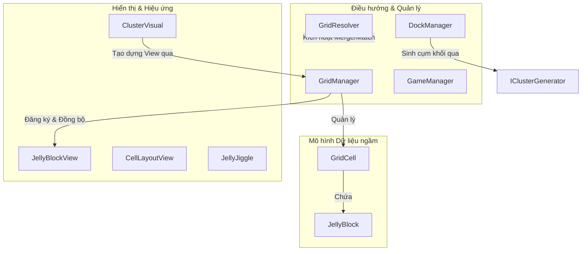

# 🎮 TỔNG QUAN DỰ ÁN JELLY FIELD

🌐 **Language:** [English](README.md) | [Tiếng Việt](README_VI.md)

---

Chào mừng đến với tài liệu hướng dẫn và đánh giá kiến trúc hệ thống trò chơi **JellyField**. Đây là tài liệu lưu trữ cục bộ dùng để mô tả chi tiết cách vận hành trò chơi, các giải thuật cốt lõi và các đề xuất tối ưu hóa sau khi refactor.

---

## 📝 Mô tả dự án (What it does)
* **Loại dự án:** Trò chơi giải đố khối thạch Jelly 3D vận hành trên hệ thống ô lưới lớn (chứa các ma trận ô con ngầm).
* **Cơ chế cốt lõi:** Người chơi thực hiện tương tác đưa các khối thạch từ khay Dock lên bàn chơi. Hệ thống tự động kích hoạt chuỗi sự kiện:
  1. Loang màu kiểm tra cụm tiếp xúc trực tiếp tại biên giới của các ô lưới lớn để kích nổ.
  2. Dạt hàng lấp khoảng trống do trọng lực.
  3. Quét chuỗi phản ứng liên hoàn (Combo) cho tới khi phân định trạng thái thắng (hoàn thành mục tiêu) hoặc thua (đầy ô lưới).

---

## 🛠️ Công nghệ & Công cụ sử dụng (Technologies & Tools)
* **Engine phát triển:** Unity.
* **Đồ họa & Hiệu ứng:**
  * **Universal Render Pipeline (URP):** Hệ thống đường ống dẫn xuất đồ họa tối ưu hóa cao cho các thiết bị di động.
  * **Vertex Shader Graph:** Xử lý hiệu ứng biến dạng đỉnh, tạo chuyển động lò xo dập dình cho khối thạch trực tiếp trên GPU thông qua tham số `_BendOffset`. Điều này giúp tiết kiệm tối đa hiệu năng CPU.
  * **DOTween:** Bộ công cụ đóng vai trò driver toán học dùng để vuốt mượt các giá trị vector truyền vào Shader Graph.
* **Hệ thống điều khiển (Input):** **New Input System** (sử dụng lớp trừu tượng `Pointer.current`) giúp đồng bộ và chạy mượt mà trên cả chuột trái (PC / Unity Editor) lẫn cảm ứng đa điểm (Android APK).

---

## 🏛️ Kiến trúc & Mẫu thiết kế (Architecture & Design Patterns)

Mã nguồn được thiết kế trên các nguyên lý lập trình hướng đối tượng (OOP) vững chắc và các mô hình phát triển game Unity hiện đại:



### 1. Mô hình MVC (Model-View-Controller)
* **Model (Logic dữ liệu ngầm):** Lớp `JellyBlock` và `GridCell` thuần C# (không kế thừa MonoBehaviour), chỉ lưu dữ liệu logic (ID, màu, vị trí ô con) tách biệt hoàn toàn khỏi luồng hiển thị của Unity.
* **View (Hiển thị trực quan):** `JellyBlockView`, `CellLayoutView`, và `ClusterVisual` lo việc render lưới 3D, điều phối hiệu ứng biến dạng dập dình mọng nước trực tiếp trên bề mặt khối thạch thông qua Vertex Shader Graph (sử dụng biến điều khiển ô lệch vị trí đỉnh thạch `_BendOffset` vuốt mượt bằng DOTween).
* **Controller (Điều phối):** `GridManager` điều phối ngầm và ánh xạ đồng bộ trạng thái logic thạch sang đối tượng đồ họa trực quan thông qua registry `blockVisuals` (`RegisterVisuals`, `GetVisuals`).

### 2. Nguyên lý SOLID
* **SRP (Đơn nhiệm):** Phân chia trách nhiệm rõ ràng. `GridManager` chỉ quản lý ô lưới, việc tính toán co dãn hiển thị vật lý được giao cho `CellLayoutView`, trong khi toàn bộ luồng xử lý nổ thạch theo combo được điều phối bởi `GridResolver`.
* **OCP (Đóng/Mở):** Khay Dock sinh khối thạch sử dụng interface `IClusterGenerator` giúp dễ dàng đổi thuật toán sinh khối (như tạo ngẫu nhiên hoặc theo hàng đợi định sẵn) mà không cần sửa code lõi của hệ thống quản lý khay `DockManager`.
* **DIP (Nghịch đảo phụ thuộc):** Hạn chế liên kết cứng giữa các hệ thống thông qua việc giao tiếp bằng interface và cache reference.

### 3. Quản lý cấu hình dữ liệu
* Áp dụng **ScriptableObject** (`LevelData`) để thiết lập bố cục và lưu trữ dữ liệu thiết kế màn chơi linh hoạt.

---

## 📂 Cấu Trúc Thư Mục Scripts

Toàn bộ mã nguồn của dự án được tổ chức gọn gàng và khoa học trong `Assets/_Game/Scripts/`:
```bash
Assets/_Game/Scripts/
├── Core/          # Model thạch, ô lưới và bộ điều hướng chính (GridManager, GridResolver, DraggableGroup)
├── Logic/         # Các thuật toán tĩnh xử lý gộp thạch và nổ thạch kề nhau (MatchResolver, MergeResolver)
├── Managers/      # Quản lý âm thanh, trạng thái game, hàng đợi sinh khối (GameManager, DockManager)
├── Level/         # ScriptableObject dữ liệu màn chơi (LevelData) và logic thiết kế màn chơi
├── View/          # Xử lý đồ họa 3D, tính toán co dãn, đàn hồi jiggle thạch (CellLayoutView, JellyJiggle)
├── UI/            # Các panel UI, giao diện chơi lại/thắng/thua (GameUIManager, GoalItemUI)
└── Editor/        # Bộ công cụ tùy biến giao diện thiết kế màn chơi trực tiếp trong Unity Editor
```

---

## ⚡ Các giải thuật cốt lõi (Core Algorithms)

### A. Tìm Cụm Match Chạm Biên (`MatchResolver` / Inter-Cell Boundary Matching)
Sử dụng thuật toán tìm kiếm theo chiều rộng **BFS (Breadth-First Search)** để loang tìm các khối thạch cùng màu kề cạnh nhau. Giải thuật chỉ xác nhận match nếu các ô con của 2 khối thạch thực sự tiếp xúc vật lý trực tiếp tại biên của ô lưới lớn.

### B. Vòng Lặp Xử Lý Grid (`GridResolver`)
Vận hành bằng một Coroutine đồng bộ giữ đúng nhịp điệu trình tự hoạt họa:
1. **Nổ cụm chạm biên:** Tìm cụm match liên kết -> tách visual, chạy hiệu ứng nổ thạch đồng màu và bắn hạt.
2. **Trọng lực dạt hàng:** Kích hoạt trọng lực dịch chuyển các khối thạch còn lại lấp đầy khoảng trống -> chạy hiệu ứng dập dình lò xo tiếp đất bằng Shader.
3. **Check End Game:** Kiểm tra điều kiện thắng (hoàn thành các mục tiêu) hoặc thua (đầy ô lưới).

---

## 💡 Đề Xuất Nâng Cấp Tương Lai (Scalability Recommendations)

1. **Object Pooling (Tối ưu hóa bộ nhớ):** Thay vì sử dụng `Instantiate` và `Destroy` liên tục khi tạo/hủy thạch, xây dựng một hệ thống Object Pool cho các khối thạch để giảm thiểu tình trạng rác bộ nhớ (Garbage Collection spikes) trên thiết bị di động cấu hình yếu.
2. **State Machine cho GameManager:** Chuyển quản lý trạng thái trò chơi sang một máy trạng thái thực thụ (các lớp trạng thái riêng biệt kế thừa từ `GameStateBase`), giúp code của `GameManager` sạch sẽ và dễ bổ sung các trạng thái mới (Pause, Tutorial...).
3. **Dependency Injection (DI):** Tích hợp **Zenject** hoặc **VContainer** khi dự án mở rộng quy mô lớn, giúp giảm thiểu sự phụ thuộc chéo của việc lạm dụng Singleton (`Instance`).
